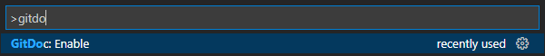

# Demo Lab

> **STUDENT_NAME**

**NOTE:** Ensure that you have enabled *GitDoc* for this lab. To do so, press <kbd>F1</kbd>, type `GitDoc: Enable` and press <kbd>Enter</kbd>.

**Read all the instructions before beginning your work!**

Your must place your work in the [src](./src/) folder. See the [ReadMe.md](./src/ReadMe.md) for setup details.

----

## OBJECTIVE

Upon completion of this exercise, you will have demonstrated the ability to:
- Identify the problem
- Construct an algorithm
- Translate an algorithm into C#
- Test an executable program.

## INTRODUCTION

